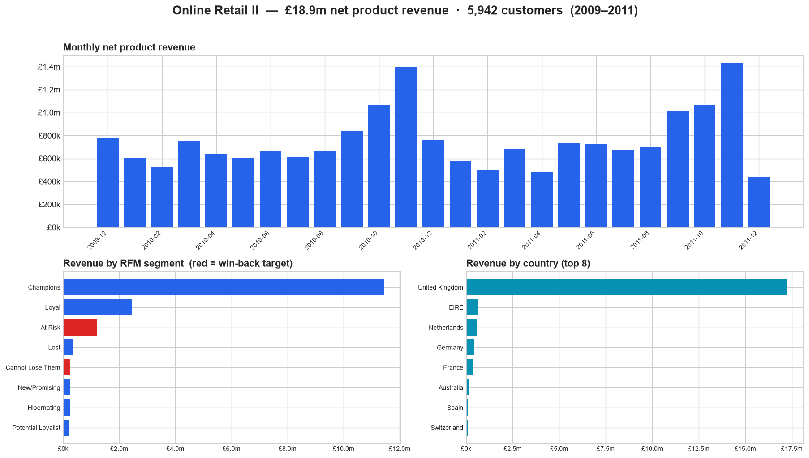

# Online Retail II — analytics pipeline & commercial analysis

An end-to-end analytics pipeline: raw spreadsheets → BigQuery → tested, modelled
tables → a commercial recommendation.

The SQL is BigQuery-native, but the whole pipeline is also verifiable locally in
DuckDB (no GCP account needed), so every model, assertion, and number in the
analysis is reproducible on any laptop in about a minute.

---

## Summary — the commercial answer

Over ~2 years this UK wholesaler did **£18.9m** net product revenue. It's a
**repeat-purchase business** (76% of buyers reorder) where the **top 20% of
customers drive 77% of revenue**. The actionable finding: **839 previously
high-value customers (worth £1.45m) have gone quiet for ~12 months.**
→ **Recommendation:** a win-back campaign to those 839, measured against a
randomised holdout. See [`analysis_answers.md`](analysis_answers.md) and
[`write_up.md`](write_up.md).



*Generated from the modelled tables by `local/make_dashboard.py` (the same views
the Streamlit app serves). Red bars = the win-back target segments.*

---

## Which dataset, and why

**Option 1 — UCI "Online Retail II"** (real UK ecommerce invoices, 2009–2011).

- **Single, fixed, downloadable source** → fully reproducible ingestion (the
  point of the exercise is cleaning, not hunting for data).
- **Genuinely messy** — 243k null customers (23%), 19k cancellations, 12k
  duplicate lines, £322k of postage disguised as product sales — so the
  extract/staging layer has real work to do.
- **Best fit for the commercial half**: customer-level RFM / LTV / win-back,
  which supports a concrete, runnable commercial campaign at the end.

---

## Architecture

```
 extract/load.py            sql/ (or dbt_project/)                      analysis
 ───────────────            ─────────────────────                       ────────
 UCI .xlsx (2 sheets)  ─▶  RAW      raw_online_retail   (1:1, no clean)
  union + metadata          │  typed · renamed · flagged · de-duplicated
  → parquet / BigQuery      ▼
                          STAGING  stg_online_retail
                            │
              ┌─────────────┼───────────────┐
              ▼             ▼                ▼
         dim_customer   dim_product      fct_sales  ──▶  RFM / insights
              (surrogate keys)           fct_orders       recommendation
```

- **3 layers:** raw (faithful landing) → staging (clean line grain) → marts
  (star schema: 2 dims + 2 facts).
- **Key strategy:** deterministic surrogate keys `TO_HEX(MD5(natural_key))` — the
  same input always yields the same key, so FKs survive a full reload
  (idempotent). Exact-duplicate lines removed in staging via a natural-line hash.
- **Types:** money as `NUMERIC`, dates as `DATE`/`TIMESTAMP`, ids as `INT64` —
  nothing left as `STRING` in the modelled layer.

---

## Repository layout

```
extract/       load.py, requirements.txt, notes.md   — extract & load
sql/           01_create_tables.sql                   — warehouse design / DDL
               02_load_transform.sql                  — staging + dims + facts
               03_analytics_queries.sql               — analytics queries
analysis_answers.md                                   — insights, recommendation, memo, LLM
write_up.md                                           — non-technical stakeholder write-up
local/         build_local.py, rfm_analysis.py        — DuckDB verification + numbers
dbt_project/   models/staging, models/marts, tests    — dbt structuring
.github/workflows/ci.yml                              — CI (builds + asserts on push)
app/           app.py                                 — Streamlit explorer
docs/          dashboard.png                          — rendered summary dashboard
```

---

## Quickstart

### Option A — Local verification (no GCP needed, recommended first)
Proves the pipeline end-to-end and prints the real analytics + assertions.

```bash
pip install -r extract/requirements.txt
pip install duckdb

python extract/load.py          # download → union → RAW parquet (data/)
python local/build_local.py     # run sql/02 + sql/03 in DuckDB, assert integrity
python local/rfm_analysis.py    # RFM segments + the numbers used in the write-up
python local/make_dashboard.py  # render docs/dashboard.png

# optional internal explorer:
pip install -r app/requirements.txt
streamlit run app/app.py
```

`build_local.py` runs the **actual BigQuery SQL** through a tiny documented shim
(`SAFE_CAST→TRY_CAST`, `FLOAT64→DOUBLE`, `SAFE_DIVIDE`/`FORMAT_DATE` macros,
backtick stripping) and **fails loudly** if any model assertion breaks (dedup,
grain, referential integrity).

### Option B — BigQuery (the real target)
```bash
# 1) Extract + load the raw table
python extract/load.py --project YOUR_GCP_PROJECT --raw-dataset online_retail

# 2) Create schema/tables (design contract) and build the models
bq query --use_legacy_sql=false < sql/01_create_tables.sql
bq query --use_legacy_sql=false < sql/02_load_transform.sql

# 3) Run the analytics
bq query --use_legacy_sql=false < sql/03_analytics_queries.sql
```
Set your default project first (`gcloud config set project YOUR_GCP_PROJECT`) so
the `online_retail.<table>` references resolve.

### Option C — dbt (bonus)
```bash
pip install dbt-bigquery
cp dbt_project/profiles.yml.example ~/.dbt/profiles.yml   # fill in your project
cd dbt_project
dbt build      # runs staging + marts and all schema.yml tests (not_null/unique/relationships)
```

---

## Assumptions & scope decisions

- **Guests (23% of lines, 14% of revenue)** are kept in company totals but
  excluded from customer-level analytics — you can't segment an anonymous buyer.
- **Cancellations** are netted out; **service codes** (POST/DOT/M/fees) are
  excluded from product analytics; **12,133 exact-duplicate lines** de-duplicated.
- **No cost/margin data** in the source → all figures are **revenue, not profit**.
- **DuckDB is used as a local stand-in** for BigQuery to make the work verifiable
  without a cloud account; the deliverable SQL is BigQuery dialect and the shim is
  small and documented (see `local/build_local.py`).
- Full data-quality reasoning is in [`extract/notes.md`](extract/notes.md) and
  the analysis notes in [`analysis_answers.md`](analysis_answers.md).

---

## Reproducing the headline numbers

All figures in the analysis come from `local/rfm_analysis.py` →
`local/analysis_outputs.json`:

| Metric | Value |
|---|---|
| Rows ingested | 1,067,371 |
| Rows after dedup (staging) | 1,033,034 |
| Net product revenue | £18,925,714 |
| Known customers | 5,942 |
| Repeat-purchase rate | 75.6% |
| Top-20% customer revenue share | 76.7% |
| Win-back target (At Risk + Cannot Lose Them) | 839 customers, £1.45m historical |

Run the three `python` commands in Option A and you'll get these exact numbers.
